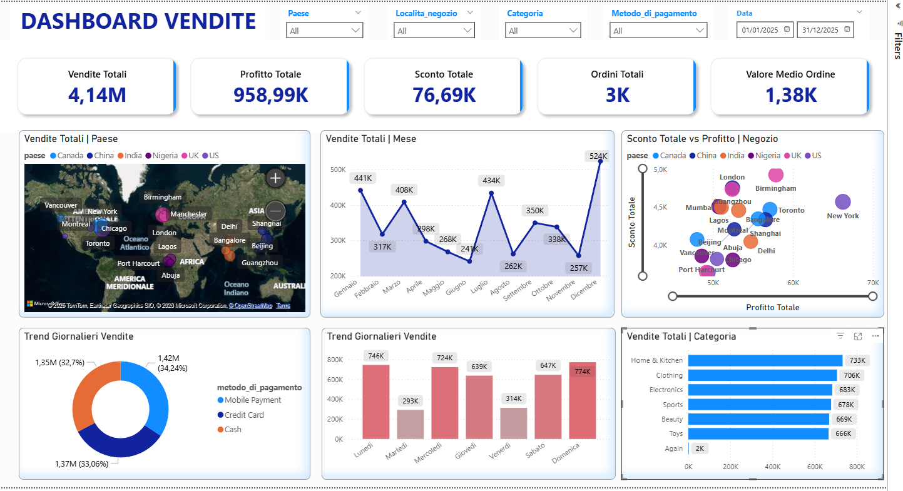

# Power BI & SQL Sales Dashboard — Analisi Vendite Globali

## Executive Summary

- **Business Problem**: I dati di vendita di 6 paesi arrivavano in file separati senza visione aggregata, rendendo impossibile confrontare performance cross-country o calcolare KPI coerenti.
- **Soluzione**: Consolidamento e pulizia in PostgreSQL + dashboard interattiva in Power BI con filtri dinamici per paese, categoria e periodo.
- **Risultati**: 4,14M € di vendite totali analizzate; 959K € di profitto; identificati top performer per prodotto, rappresentante e località negozio.
- **Prossimi Passi**: Aggiungere analisi YoY per confronto con anno precedente; integrare dati di budget per calcolare scostamento target vs actual.

---

## Business Problem

Sei mercati (Canada, Cina, India, Nigeria, UK, US), sei file separati, nessuna visione d'insieme. Senza un dataset unificato era impossibile rispondere a domande fondamentali: *"Quale paese genera più profitto?"*, *"Chi sono i rappresentanti più performanti?"*, *"Come si distribuiscono le vendite per categoria?"*.

---

## Metodologia

1. **Consolidamento (SQL)** → Le sei tabelle vengono unite con `UNION ALL` in un'unica `dati_vendite`.
2. **Data Quality (SQL)** → Rilevati e corretti due record con valori mancanti: una quantità nulla aggiornata manualmente, un prezzo imputato con la media del prodotto nella stessa categoria.
3. **Metriche derivate (SQL)** → `quantita_totale` (prezzo × quantità − sconto) e `profitto` (ricavo − costo) calcolate e aggiunte come colonne persistenti.
4. **Dashboard (Power BI)** → Visualizzazione KPI, mappa geografica, trend mensile, top performer per prodotto e rappresentante, correlazione sconto-profitto.

---

## Competenze

- **SQL**: `UNION ALL`, `UPDATE` con subquery, aggregazioni, colonne derivate calcolate
- **Power BI**: Mappa interattiva, filtri dinamici, scatter plot, KPI cards, grafici a barre e torta
- **DAX**: Misure aggregate per KPI principali

---

## Risultati & Raccomandazioni

- **KPI Principali**: Vendite totali 4,14M € · Profitto totale 959K € · 3.000+ ordini · Valore medio ordine 1,38K €
- **Correlazione sconto-profitto**: Lo scatter plot evidenzia pattern non lineari — alcuni negozi con sconti elevati mantengono margini alti, altri con sconti bassi underperformano. **Raccomandazione**: analizzare il mix di prodotto per negozio prima di applicare politiche di sconto uniformi.
- **Top performer**: I 5 prodotti e i 5 rappresentanti con fatturato più alto sono identificati e monitorabili dinamicamente per qualsiasi periodo selezionato.

---

## Prossimi Passi

1. Aggiungere confronto Year-over-Year per misurare crescita rispetto all'anno precedente.
2. Integrare dati di budget per calcolare scostamento target vs actual per paese e categoria.
3. Costruire alert automatici per rappresentanti sotto soglia di performance.

---

## Dashboard



---

## Struttura della Repository

```
├── scripts/
│   ├── 00_creazione_tabelle.sql        # Creazione schema database
│   ├── 01_inserimento_dati.sql         # Import dati CSV
│   ├── 02_creazione_tabella_unica.sql  # Consolidamento dati
│   ├── 03_data_cleaning.sql            # Pulizia e trasformazione
│   └── 04_business_insights.sql        # Query di analisi
├── Dashboard_Vendite.pbix              # File Power BI
├── Dashboard_Screenshot.png            # Preview dashboard
├── Formule_DAX.md                      # Documentazione misure DAX
└── README.md
```

**Stack**: PostgreSQL · SQL · Power BI · DAX
